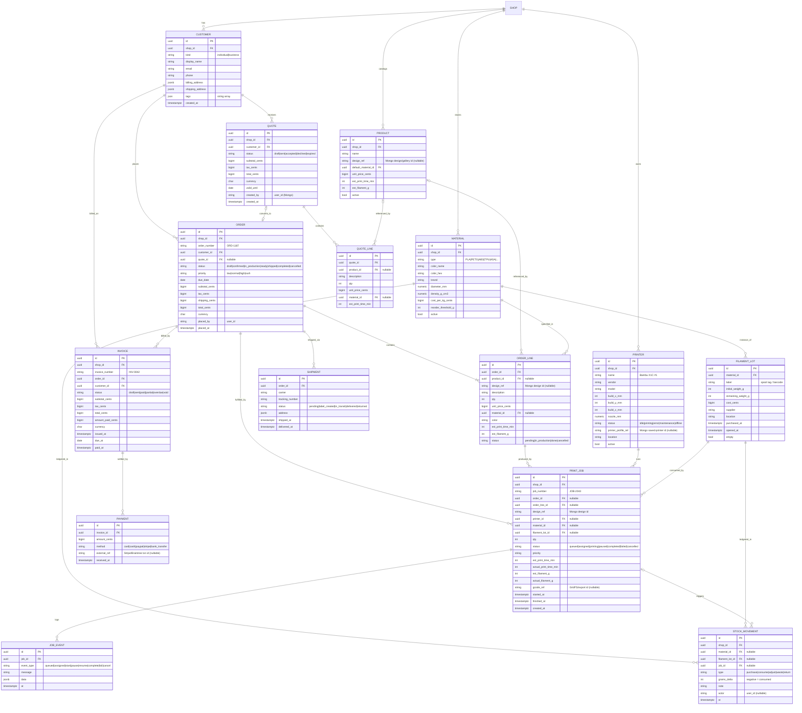

# ForgeSlicer — ERP Data Model

> Design doc for the "shop OS" direction: turning ForgeSlicer from a CAD +
> slicer tool into an ERP-type system for 3D print shops. Covers the
> **Orders**, **Production**, and **Inventory** modules (and the CRM /
> billing glue around them) that back the scaffold pages in
> `frontend/src/components/modules/`.
>
> Status: **proposed** — no migrations or backend wiring exist yet. The
> module pages currently render static demo data.

---

## 1. Principles

1. **Relational core.** ERP data is inherently relational (orders → line
   items → jobs → material consumption → invoices). Model it in a real
   relational store, not documents. See §2 for engine choice.
2. **Reference, don't join across stores.** The creative/SaaS data
   (user accounts, designs, gallery, components, saved printers) already
   lives in **MongoDB**. The ERP references those by opaque string id
   (`design_ref`, `user_id`, `printer_profile_ref`) and never tries to
   JOIN into Mongo. This keeps the boundary clean and lets each store
   evolve independently.
3. **Money is integer minor units.** Every monetary column is
   `amount_cents BIGINT` + a `currency CHAR(3)` (ISO-4217). Never floats.
4. **Stable PKs + human ids.** Primary keys are UUIDs (or ULIDs for
   sortability). Human-facing identifiers (`ORD-1187`, `JOB-2043`,
   `INV-0042`) are separate, indexed, unique strings generated per shop.
5. **Everything is auditable.** `created_at` / `updated_at` on every
   table; status changes and stock movements are append-only ledgers, not
   in-place mutations, so history is never lost.
6. **Multi-shop ready.** A top-level `shop` (tenant) row scopes every
   business entity via `shop_id`. A single-shop/desktop install just has
   one `shop` row.

---

## 2. Storage strategy

| Data | Store | Why |
|---|---|---|
| ERP: customers, orders, jobs, printers, materials, invoices | **Relational** | Joins, constraints, aggregates, transactions |
| Designs, projects, components, gallery | **MongoDB** (existing) | Document-shaped, already built |
| User accounts, sessions, auth | **MongoDB** (existing) | Already built (`auth_local`, `users`) |

Engine choice for the relational side:

- **Multi-seat hosted shop server → PostgreSQL.** Concurrency, real
  constraints, `NUMERIC`/`JSONB`, row-level security for multi-tenant.
- **Single-shop / desktop (Tauri/Electron) install → SQLite.** Zero-config,
  single file, embedded. The schema below is written for Postgres; SQLite
  notes are in the appendix (§9).

Put all relational access behind a **repository/data-access layer** so the
same service code runs against Postgres or SQLite, and so Mongo-backed
lookups (resolve a `design_ref` to a thumbnail, a `user_id` to a name)
stay in one place.

---

## 3. Entity-relationship diagram



---

## 4. Entity reference (by domain)

### CRM
- **shop** — tenant root. One row for a single-shop install. Owns all
  business rows via `shop_id`. Fields: name, timezone, default_currency,
  tax settings.
- **customer** — individual or business buyer. Holds contact + billing /
  shipping addresses (JSON), tags for segmentation. Links to Mongo
  `user_id` optionally if the customer also has a ForgeSlicer login.

### Catalog / Sales
- **product** — a sellable catalog item, optionally tied to a design
  (`design_ref` → Mongo). Carries default price + print estimates so
  quoting is one click. Optional — walk-up jobs can skip the catalog and
  put a free-text `description` on the line directly.
- **quote** / **quote_line** — pre-sale estimate. On acceptance a quote
  **converts to an order** (`order.quote_id`), copying its lines.
- **order** / **order_line** — the confirmed job of work. `order_line`
  is the unit that gets scheduled into production (qty N of a design in a
  material/color). Its `status` rolls up from its jobs.

### Production
- **printer** — a physical machine (with build volume + nozzle), optionally
  linked to a Mongo saved-printer profile (`printer_profile_ref`) for slice
  settings. `status` drives the Production farm grid.
- **print_job** — one schedulable unit of printing. May be created from an
  `order_line` (fulfilment) or standalone (R&D / stock builds). Tracks
  estimated vs actual time + filament, which printer + which spool it ran
  on, and a `gcode_ref` to the sliced output.
- **job_event** — append-only history for a job (queued → start → complete
  / fail). Powers timelines, throughput analytics, and failure tracking.

### Inventory
- **material** — a filament *definition* / SKU (type + color + brand +
  diameter + cost/kg + reorder threshold). This is what an `order_line`
  and `print_job` reference for "what to print in."
- **filament_lot** — a *physical* spool instance of a material, with
  remaining grams. Depletes as jobs consume it.
- **stock_movement** — append-only ledger of grams in/out
  (`purchase|consume|adjust|waste|return`). Current stock = sum of
  movements (or the cached `remaining_weight_g` on the lot, reconciled
  against the ledger). A completed `print_job` writes a `consume` movement.

### Billing
- **invoice** / **payment** — shop-order billing, **separate** from the
  existing SaaS subscription billing (Stripe/Braintree in Mongo). An order
  can be billed by one or more invoices; a payment can settle part of an
  invoice (`amount_paid_cents` tracks partials). `external_ref` links to
  the payment processor when a card is charged.

### Fulfilment
- **shipment** — optional; tracks carrier + tracking per order.

---

## 5. Cross-store references (relational ↔ Mongo)

| Column | Points to (Mongo) | Resolved via |
|---|---|---|
| `product.design_ref`, `order_line.design_ref`, `print_job.design_ref` | `gallery` / `projects` design id | designs API |
| `printer.printer_profile_ref` | saved printer (`user_printers` / community) | printers API |
| `print_job.gcode_ref` | export/GridFS handoff id | exports route |
| `*.created_by` / `placed_by` / `actor` | `users.user_id` | auth/users |
| `customer.user_id` (optional) | `users.user_id` | auth/users |

These are **soft references** (strings), resolved by the repository layer
with a short-lived cache. No foreign-key constraint spans stores.

---

## 6. Conventions

- **IDs:** UUID/ULID PKs; unique per-shop human numbers via a `counters`
  table or Postgres sequence (`ORD-`, `JOB-`, `INV-`, `QUO-` prefixes).
- **Money:** `*_cents BIGINT` + `currency CHAR(3)`. Compute totals in the
  service layer; store the snapshot on the order/invoice so historical
  documents don't shift when a price changes.
- **Enums:** modeled as `TEXT` + `CHECK (... IN (...))` for portability
  (Postgres native `ENUM` is fine too but harder to alter; SQLite has no
  enum). Keep the allowed values in one shared constants module.
- **Timestamps:** `created_at`, `updated_at` (trigger or app-set) on every
  table; `timestamptz` in Postgres, ISO-8601 TEXT in SQLite.
- **Soft-delete:** prefer `status='cancelled'` / `active=false` over hard
  deletes for anything financial or historical.
- **Tenancy:** every business table carries `shop_id`; index it and filter
  every query by it. Add Postgres row-level security if hosting multiple
  shops.

---

## 7. How it maps to the current UI

| Module page | Reads | KPI aggregates |
|---|---|---|
| `OrdersPage` | `order` ⨝ `customer`, `order_line` | open orders (status), awaiting-quote (`quote.status='sent'`), backlog value (Σ `total_cents` where not completed) |
| `ProductionPage` | `print_job` ⨝ `printer` ⨝ `material`/`filament_lot`; `job_event` | printers running (`printer.status='printing'`), utilisation, revenue-7d (Σ paid invoices) |
| `InventoryPage` | `material` ⨝ `filament_lot`; `stock_movement` | spools tracked, kg on hand (Σ `remaining_weight_g`), low/reorder (`remaining < reorder_threshold_g`) |

The static demo arrays in those files map 1:1 to these tables, so wiring
them up is "replace the constant with a fetch."

---

## 8. Suggested build phases

1. **Schema + repository layer** (this doc) — tables, migrations, the
   store-abstraction + Mongo-ref resolver.
2. **Inventory first** — simplest, self-contained (materials, lots, stock
   ledger). Immediately useful and low-risk.
3. **Orders + CRM** — customers, quotes→orders, line items.
4. **Production** — printers + jobs + job events; link order_line → jobs;
   consume stock on completion (writes `stock_movement`).
5. **Billing** — invoices + payments; reuse the existing Stripe/Braintree
   integration for card capture, writing `payment.external_ref`.
6. **Analytics/reporting** — throughput, utilisation, revenue, cost of
   goods (filament consumed × cost/kg).

---

## 9. Appendix — Postgres DDL sketch (core tables)

Illustrative, not final. SQLite notes follow.

```sql
CREATE TABLE shop (
  id            UUID PRIMARY KEY,
  name          TEXT NOT NULL,
  timezone      TEXT NOT NULL DEFAULT 'UTC',
  currency      CHAR(3) NOT NULL DEFAULT 'USD',
  created_at    TIMESTAMPTZ NOT NULL DEFAULT now()
);

CREATE TABLE customer (
  id            UUID PRIMARY KEY,
  shop_id       UUID NOT NULL REFERENCES shop(id),
  kind          TEXT NOT NULL CHECK (kind IN ('individual','business')),
  display_name  TEXT NOT NULL,
  email         TEXT,
  phone         TEXT,
  billing_address  JSONB,
  shipping_address JSONB,
  user_id       TEXT,                       -- soft ref → Mongo users
  tags          TEXT[] DEFAULT '{}',
  created_at    TIMESTAMPTZ NOT NULL DEFAULT now(),
  updated_at    TIMESTAMPTZ NOT NULL DEFAULT now()
);
CREATE INDEX customer_shop_idx ON customer(shop_id);

CREATE TABLE material (
  id                 UUID PRIMARY KEY,
  shop_id            UUID NOT NULL REFERENCES shop(id),
  type               TEXT NOT NULL,
  color_name         TEXT,
  color_hex          TEXT,
  brand              TEXT,
  diameter_mm        NUMERIC(4,2) NOT NULL DEFAULT 1.75,
  density_g_cm3      NUMERIC(5,3),
  cost_per_kg_cents  BIGINT NOT NULL DEFAULT 0,
  reorder_threshold_g INT NOT NULL DEFAULT 250,
  active             BOOLEAN NOT NULL DEFAULT true
);

CREATE TABLE filament_lot (
  id                UUID PRIMARY KEY,
  material_id       UUID NOT NULL REFERENCES material(id),
  label             TEXT,
  initial_weight_g  INT NOT NULL,
  remaining_weight_g INT NOT NULL,
  cost_cents        BIGINT,
  supplier          TEXT,
  location          TEXT,
  purchased_at      TIMESTAMPTZ,
  opened_at         TIMESTAMPTZ,
  empty             BOOLEAN NOT NULL DEFAULT false
);

CREATE TABLE printer (
  id           UUID PRIMARY KEY,
  shop_id      UUID NOT NULL REFERENCES shop(id),
  name         TEXT NOT NULL,
  vendor       TEXT, model TEXT,
  build_x_mm   INT, build_y_mm INT, build_z_mm INT,
  nozzle_mm    NUMERIC(3,1) DEFAULT 0.4,
  status       TEXT NOT NULL DEFAULT 'idle'
               CHECK (status IN ('idle','printing','error','maintenance','offline')),
  printer_profile_ref TEXT,                 -- soft ref → Mongo
  location     TEXT,
  active       BOOLEAN NOT NULL DEFAULT true
);

CREATE TABLE "order" (
  id            UUID PRIMARY KEY,
  shop_id       UUID NOT NULL REFERENCES shop(id),
  order_number  TEXT NOT NULL,
  customer_id   UUID NOT NULL REFERENCES customer(id),
  quote_id      UUID,
  status        TEXT NOT NULL DEFAULT 'draft'
                CHECK (status IN ('draft','confirmed','in_production','ready','shipped','completed','cancelled')),
  priority      TEXT NOT NULL DEFAULT 'normal',
  due_date      DATE,
  subtotal_cents BIGINT NOT NULL DEFAULT 0,
  tax_cents      BIGINT NOT NULL DEFAULT 0,
  shipping_cents BIGINT NOT NULL DEFAULT 0,
  total_cents    BIGINT NOT NULL DEFAULT 0,
  currency       CHAR(3) NOT NULL DEFAULT 'USD',
  placed_by      TEXT,
  placed_at      TIMESTAMPTZ NOT NULL DEFAULT now(),
  UNIQUE (shop_id, order_number)
);
CREATE INDEX order_shop_status_idx ON "order"(shop_id, status);

CREATE TABLE order_line (
  id            UUID PRIMARY KEY,
  order_id      UUID NOT NULL REFERENCES "order"(id) ON DELETE CASCADE,
  product_id    UUID,
  design_ref    TEXT,                        -- soft ref → Mongo
  description   TEXT NOT NULL,
  qty           INT NOT NULL DEFAULT 1,
  unit_price_cents BIGINT NOT NULL DEFAULT 0,
  material_id   UUID REFERENCES material(id),
  color         TEXT,
  est_print_time_min INT,
  est_filament_g     INT,
  status        TEXT NOT NULL DEFAULT 'pending'
                CHECK (status IN ('pending','in_production','done','cancelled'))
);

CREATE TABLE print_job (
  id             UUID PRIMARY KEY,
  shop_id        UUID NOT NULL REFERENCES shop(id),
  job_number     TEXT NOT NULL,
  order_id       UUID REFERENCES "order"(id),
  order_line_id  UUID REFERENCES order_line(id),
  design_ref     TEXT,
  printer_id     UUID REFERENCES printer(id),
  material_id    UUID REFERENCES material(id),
  filament_lot_id UUID REFERENCES filament_lot(id),
  qty            INT NOT NULL DEFAULT 1,
  status         TEXT NOT NULL DEFAULT 'queued'
                 CHECK (status IN ('queued','assigned','printing','paused','completed','failed','cancelled')),
  priority       TEXT NOT NULL DEFAULT 'normal',
  est_print_time_min INT, actual_print_time_min INT,
  est_filament_g     INT, actual_filament_g     INT,
  gcode_ref      TEXT,
  started_at     TIMESTAMPTZ, finished_at TIMESTAMPTZ,
  created_at     TIMESTAMPTZ NOT NULL DEFAULT now(),
  UNIQUE (shop_id, job_number)
);
CREATE INDEX print_job_printer_status_idx ON print_job(printer_id, status);

CREATE TABLE stock_movement (
  id             UUID PRIMARY KEY,
  shop_id        UUID NOT NULL REFERENCES shop(id),
  material_id    UUID REFERENCES material(id),
  filament_lot_id UUID REFERENCES filament_lot(id),
  job_id         UUID REFERENCES print_job(id),
  type           TEXT NOT NULL CHECK (type IN ('purchase','consume','adjust','waste','return')),
  grams_delta    INT NOT NULL,               -- negative = consumed
  note           TEXT,
  actor          TEXT,
  at             TIMESTAMPTZ NOT NULL DEFAULT now()
);

CREATE TABLE invoice (
  id             UUID PRIMARY KEY,
  shop_id        UUID NOT NULL REFERENCES shop(id),
  invoice_number TEXT NOT NULL,
  order_id       UUID NOT NULL REFERENCES "order"(id),
  customer_id    UUID NOT NULL REFERENCES customer(id),
  status         TEXT NOT NULL DEFAULT 'draft'
                 CHECK (status IN ('draft','sent','paid','partial','overdue','void')),
  subtotal_cents BIGINT NOT NULL DEFAULT 0,
  tax_cents      BIGINT NOT NULL DEFAULT 0,
  total_cents    BIGINT NOT NULL DEFAULT 0,
  amount_paid_cents BIGINT NOT NULL DEFAULT 0,
  currency       CHAR(3) NOT NULL DEFAULT 'USD',
  issued_at      TIMESTAMPTZ, due_at DATE, paid_at TIMESTAMPTZ,
  UNIQUE (shop_id, invoice_number)
);

CREATE TABLE payment (
  id           UUID PRIMARY KEY,
  invoice_id   UUID NOT NULL REFERENCES invoice(id) ON DELETE CASCADE,
  amount_cents BIGINT NOT NULL,
  method       TEXT NOT NULL,
  external_ref TEXT,
  received_at  TIMESTAMPTZ NOT NULL DEFAULT now()
);
```

### SQLite variance (desktop build)
- `UUID`/`TIMESTAMPTZ` → `TEXT`; `JSONB`/`TEXT[]` → `TEXT` (JSON string).
- `BIGINT` → `INTEGER` (SQLite integers are 64-bit).
- `CHECK (... IN (...))` and `REFERENCES` are supported (enable
  `PRAGMA foreign_keys = ON`).
- No sequences → generate human ids in the app; no `now()` default →
  set timestamps in the repository layer.
- Store large binaries (gcode, 3MF) as files under the app data dir and
  keep only the path in `gcode_ref`, rather than BLOBs.
